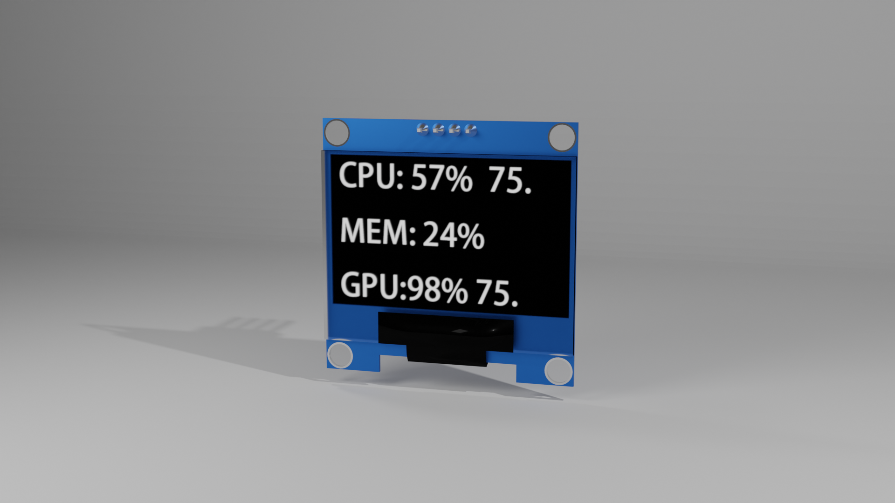

# PC性能资源监视器

> PC性能监视项目是一个pc软件和嵌入式软件结合的项目，它可以读取PC的性能资源并通过串口发送到开发板上，开发板将接收来的数据显示在oled屏幕上。
> PC软件：选用 [OpenHradwareMonitorLib](https://github.com/openhardwaremonitor/openhardwaremonitor) 来读取PC的性能资源，使用modbus协议通过串口发送出去
> 嵌入式软件：开发板选用esp32，通过串口接收到数据及解析数据，使用IIC接口驱动LOED屏幕显示。

# future

*	绘制定制电路板
*	使用更大的屏幕显示
*	添加温度传感器检测机箱内部温度
*	开发移动应用？

